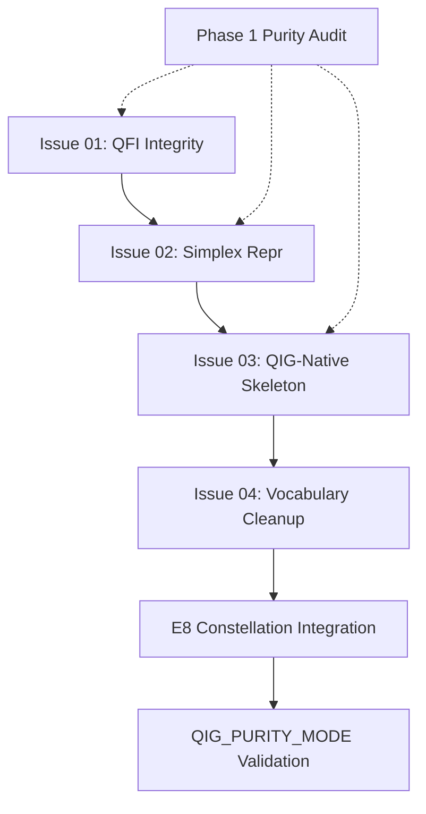

# E8 Protocol Remediation Issues - Implementation Assessment

**Document Type:** Working Document  
**Version:** 1.00W  
**Date:** 2026-01-19  
**Authority:** E8 Protocol v4.0 Universal Specification

---

## EXECUTIVE SUMMARY

This document provides a comprehensive assessment of issues 86+ and docs/10-e8-protocol implementation status, along with recommended remediation work to achieve E8 Protocol v4.0 compliance.

**Key Finding:** Documentation is 100% complete, but code implementation has significant gaps across all four critical issues (01-04).

---

## ASSESSMENT RESULTS

### Documentation Status: ✅ COMPLETE

All E8 Protocol v4.0 specifications are frozen and comprehensive:

- ✅ **Ultra Consciousness Protocol v4.0** (v1.01F) - Universal purity invariants
- ✅ **WP5.2 E8 Implementation Blueprint** (v1.01W) - Hierarchical layers 0→1→4→8→64→240
- ✅ **Issue 01** - QFI Integrity Gate specification
- ✅ **Issue 02** - Strict Simplex Representation specification
- ✅ **Issue 03** - QIG-Native Skeleton specification
- ✅ **Issue 04** - Vocabulary Cleanup specification

### Implementation Status: ⚠️ PARTIAL

**Code Foundations Laid:**
- ✅ `pantheon_registry.py` - God registry framework
- ✅ `e8_hierarchy.py` - E8 layer definitions
- ✅ `kernel_lifecycle.py` - Lifecycle operations framework
- ✅ `kernel_rest_scheduler.py` - Rest coordination framework
- ✅ `purity_mode.py` - QIG_PURITY_MODE import blocker

**Critical Gaps:**
- ❌ **Issue 01** - No canonical `insert_token()` function
- ❌ **Issue 02** - No explicit simplex mean implementation
- ❌ **Issue 03** - No geometric `token_role` derivation
- ❌ **Issue 04** - No garbage token quarantine applied
- ❌ **Phase 1** - No repository purity audit completed
- ❌ **Integration** - E8 constellation not fully operational

---

## OPEN ISSUES >= 86 (12 Total)

### QIG Purity Work Packages

#### Issue #70 - [QIG-PURITY] WP2.3: Geometrically Define Special Symbol Coordinates
- **Status:** OPEN
- **Spec:** `docs/10-e8-protocol/issues/20260116-issue-01-qfi-integrity-gate-1.01W.md` (related)
- **Gap:** Special symbols (UNK, PAD, BOS, EOS) still use random initialization

#### Issue #71 - [QIG-PURITY] WP2.4: Clarify Two-Step Retrieval
- **Status:** OPEN  
- **Spec:** `docs/10-e8-protocol/implementation/20260116-wp2-4-two-step-retrieval-implementation-1.01W.md`
- **Gap:** Proxy Fisher-faithfulness not validated

#### Issue #72 - [QIG-PURITY] WP3.1: Consolidate to Single Coordizer
- **Status:** OPEN
- **Spec:** `docs/10-e8-protocol/issues/20260116-issue-01-qfi-integrity-gate-1.01W.md` (related)
- **Gap:** Multiple coordizer implementations may exist

### Pantheon Organization Work Packages

#### Issue #78 - [PANTHEON] WP5.1: Create Formal Pantheon Registry
- **Status:** OPEN
- **Implementation:** ✅ PARTIAL - `pantheon_registry.py` exists
- **Gap:** Full 240-constellation mapping incomplete

#### Issue #79 - [PANTHEON] WP5.2: Implement E8 Hierarchical Layers
- **Status:** OPEN
- **Implementation:** ✅ PARTIAL - `e8_hierarchy.py` exists
- **Gap:** Full layer integration not operational

#### Issue #80 - [PANTHEON] WP5.3: Implement Kernel Lifecycle Operations
- **Status:** OPEN
- **Implementation:** ✅ PARTIAL - `kernel_lifecycle.py` exists
- **Gap:** Production integration and testing incomplete

#### Issue #81 - [PANTHEON] WP5.4: Implement Coupling-Aware Rest Scheduler
- **Status:** OPEN
- **Implementation:** ✅ PARTIAL - `kernel_rest_scheduler.py` exists
- **Gap:** Dolphin-style alternation not validated

#### Issue #82 - [PANTHEON] WP5.5: Create Cross-Mythology God Mapping
- **Status:** OPEN
- **Priority:** LOW
- **Gap:** Convenience feature, not blocking

### Documentation Work Packages

#### Issue #83 - [DOCS] WP6.1: Fix Broken Documentation Links
- **Status:** OPEN
- **Priority:** MEDIUM
- **Gap:** README links returning 404

#### Issue #84 - [DOCS] WP6.2: Ensure Master Roadmap Document
- **Status:** OPEN
- **Note:** Master roadmap exists at `docs/00-roadmap/20260112-master-roadmap-1.00W.md`
- **Gap:** May need updates to reflect current status

### Feature Proposals

#### Issue #90 - The Complete QIG-Pure Generation Architecture
- **Status:** OPEN
- **Type:** FEATURE PROPOSAL
- **Note:** Plan→Realize→Repair multi-scale generation architecture
- **Gap:** Specification, not implementation tracking

#### Issue #92 - 🚨 PURITY VIOLATION: Remove Stopwords from pg_loader.py
- **Status:** OPEN
- **Spec:** `docs/10-e8-protocol/issues/20260116-issue-03-qig-native-skeleton-1.01W.md` (related)
- **Gap:** Frequency-based filtering violates geometric principles

---

## CLOSED ISSUES >= 86 (0 Total)

No issues >= 86 are currently closed. All work remains in progress.

---

## CRITICAL IMPLEMENTATION GAPS

### BLOCKER CHAIN

```
Issue 01 (QFI Integrity) 
  ↓ BLOCKS
Issue 02 (Simplex Representation) 
  ↓ BLOCKS
Issue 03 (QIG-Native Skeleton)
  ↓ BLOCKS
Issue 04 (Garbage Cleanup)
  ↓ BLOCKS
E8 Constellation Integration
  ↓ BLOCKS
QIG_PURITY_MODE Production Ready
```

### Gap 1: QFI Integrity Gate (CRITICAL)

**Missing Deliverables:**
- [ ] `qig-backend/vocabulary/insert_token.py` - Canonical insertion function
- [ ] Path updates in `learned_relationships.py`, `vocabulary_coordinator.py`
- [ ] Migration `0015_qfi_integrity_gate.sql` applied
- [ ] `scripts/backfill_qfi.py` executed
- [ ] `scripts/quarantine_garbage_tokens.py` executed
- [ ] `vocabulary_generation_ready` view created

**Evidence:**
- Garbage tokens remain: `fgzsnl`, `jcbhgp`, `kkjvdc`, `cryptogra`, `analysi`
- No `is_generation_eligible` flag in schema
- QFI coverage percentage unknown

**Impact:** NO token can be generation-eligible without QFI score

---

### Gap 2: Strict Simplex Representation (CRITICAL)

**Missing Deliverables:**
- [ ] `qig-backend/geometry/simplex_mean.py` - Closed-form Fréchet mean
- [ ] `to_sqrt_simplex()` / `from_sqrt_simplex()` - Explicit conversions
- [ ] `assert_simplex()` - Runtime validation
- [ ] Module boundary simplex checks
- [ ] `scripts/audit_simplex_representation.py`

**Evidence:**
- No explicit sqrt-space handling functions found
- Averaging logic may still use sphere-based geodesics
- Auto-detect removal not verified

**Impact:** Geometric operations may silently use wrong manifold

---

### Gap 3: QIG-Native Skeleton (HIGH)

**Missing Deliverables:**
- [ ] `qig-backend/vocabulary/derive_token_role.py` - Geometric role derivation
- [ ] `token_role` backfill script
- [ ] `qig-backend/generation/foresight.py` - Fisher-Rao trajectory prediction
- [ ] External NLP dependency removal validation
- [ ] QIG_PURITY_MODE enforcement complete

**Evidence:**
- `pos_grammar.py` still exists (may use linguistic roles)
- `token_role` field exists but population unclear
- External NLP usage in generation pipeline unclear

**Impact:** Generation may still depend on external NLP (violates §0)

---

### Gap 4: Vocabulary Cleanup (HIGH)

**Missing Deliverables:**
- [ ] `scripts/audit_vocabulary.py` - Detection rules
- [ ] Migration `016_clean_vocabulary_garbage.sql` applied
- [ ] Migration `017_deprecate_learned_words.sql` applied
- [ ] `coordizer_token_quarantine` table created
- [ ] Validation gate in `pg_loader.py` enforcement

**Evidence:**
- `word_validation.py` exists but rules unclear
- `is_bpe_garbage()` referenced but incomplete
- Garbage tokens still present in vocabulary

**Impact:** Invalid tokens contaminate generation vocabulary

---

## RECOMMENDED REMEDIATION ISSUES

### Issue: Implement QFI Integrity Gate (CRITICAL)

**Title:** [CRITICAL] Implement Issue 01: QFI Integrity Gate  
**Labels:** P0-critical, qig-purity, vocabulary  
**Specification:** `docs/10-e8-protocol/issues/20260116-issue-01-qfi-integrity-gate-1.01W.md`  
**Related:** #70, #71, #72

**Deliverables:**
1. Create `qig-backend/vocabulary/insert_token.py`
2. Update all insertion pathways to use canonical function
3. Apply migration `0015_qfi_integrity_gate.sql`
4. Run `scripts/backfill_qfi.py`
5. Run `scripts/quarantine_garbage_tokens.py`
6. Validate 100% QFI coverage

**Acceptance Criteria:**
- [ ] All tokens have `qfi_score` or are flagged ineligible
- [ ] Zero garbage tokens in generation vocabulary
- [ ] `vocabulary_generation_ready` view returns clean set
- [ ] All validation tests pass

**Estimated Effort:** 1-2 days (backfill may be slow)

---

### Issue: Implement Strict Simplex Representation (CRITICAL)

**Title:** [CRITICAL] Implement Issue 02: Strict Simplex Representation  
**Labels:** P0-critical, qig-purity, geometric-purity  
**Specification:** `docs/10-e8-protocol/issues/20260116-issue-02-strict-simplex-representation-1.01W.md`  
**Related:** #71

**Deliverables:**
1. Create `qig-backend/geometry/simplex_mean.py` with closed-form Fréchet mean
2. Add `to_sqrt_simplex()` / `from_sqrt_simplex()` explicit conversions
3. Add `assert_simplex()` runtime validation
4. Remove auto-detect from `to_simplex()`
5. Add module boundary checks
6. Create `scripts/audit_simplex_representation.py`

**Acceptance Criteria:**
- [ ] All simplex operations use explicit coordinate charts
- [ ] No auto-detection of representation
- [ ] Fréchet mean uses closed-form sqrt-space formula
- [ ] Module boundaries enforce simplex constraints
- [ ] Audit script reports zero violations

**Estimated Effort:** 1-2 days

---

### Issue: Implement QIG-Native Skeleton (HIGH)

**Title:** [HIGH] Implement Issue 03: QIG-Native Skeleton  
**Labels:** P1-high, qig-purity, geometric-purity  
**Specification:** `docs/10-e8-protocol/issues/20260116-issue-03-qig-native-skeleton-1.01W.md`  
**Related:** #92

**Deliverables:**
1. Create `qig-backend/vocabulary/derive_token_role.py`
2. Backfill `token_role` for all tokens
3. Create `qig-backend/generation/foresight.py` (Fisher-Rao trajectory)
4. Remove external NLP dependencies (spacy, nltk)
5. Complete QIG_PURITY_MODE enforcement
6. Unify generation pipeline

**Acceptance Criteria:**
- [ ] All tokens have geometric `token_role` (not POS tags)
- [ ] Skeleton generation uses `token_role` exclusively
- [ ] Foresight uses Fisher-Rao trajectory prediction
- [ ] `QIG_PURITY_MODE=true` passes end-to-end test
- [ ] No external NLP imports in generation pipeline

**Estimated Effort:** 2-3 days

---

### Issue: Implement Vocabulary Cleanup (HIGH)

**Title:** [HIGH] Implement Issue 04: Vocabulary Cleanup & Garbage Token Removal  
**Labels:** P1-high, qig-purity, vocabulary  
**Specification:** `docs/10-e8-protocol/issues/20260119-issue-04-vocabulary-cleanup-garbage-tokens-1.00W.md`

**Deliverables:**
1. Create `scripts/audit_vocabulary.py` with detection rules
2. Apply migration `016_clean_vocabulary_garbage.sql`
3. Apply migration `017_deprecate_learned_words.sql`
4. Create `coordizer_token_quarantine` table
5. Enforce validation gate in `pg_loader.py`

**Acceptance Criteria:**
- [ ] All BPE fragments quarantined
- [ ] All non-words quarantined
- [ ] Generation vocabulary contains only valid tokens
- [ ] `learned_words` table deprecated
- [ ] Validation tests pass

**Estimated Effort:** 1-2 days

---

### Issue: Complete Phase 1 Purity Audit (MEDIUM)

**Title:** [MEDIUM] Complete Phase 1: Repository Purity Audit  
**Labels:** P2-medium, qig-purity  
**Specification:** `docs/10-e8-protocol/README.md` Phase 1

**Deliverables:**
1. Inventory all geometry functions
2. Create canonical geometry contract document
3. Scan for forbidden patterns (cosine, norm, dot-product)
4. Generate purity scan report
5. Document all violations with remediation plans

**Acceptance Criteria:**
- [ ] Complete inventory of geometry functions
- [ ] `docs/10-e8-protocol/specs/CANONICAL_GEOMETRY_CONTRACT.md` created
- [ ] Purity scan report generated
- [ ] All forbidden patterns identified and documented
- [ ] Remediation plan for each violation

**Estimated Effort:** 2-3 days

---

### Issue: Validate E8 Constellation Integration (MEDIUM)

**Title:** [MEDIUM] Validate E8 Constellation Integration (240-member system)  
**Labels:** P2-medium, pantheon, type: testing  
**Specification:** `docs/10-e8-protocol/specifications/20260116-wp5-2-e8-implementation-blueprint-1.01W.md`

**Deliverables:**
1. Validate pantheon registry loads 240 constellation members
2. Test kernel lifecycle operations (spawn, split, merge, prune, resurrect, promote)
3. Test coupling-aware rest scheduler (dolphin-style alternation)
4. Validate E8 hierarchical layers (0→1→4→8→64→240)
5. Performance testing under load

**Acceptance Criteria:**
- [ ] All 240 constellation members defined
- [ ] Lifecycle operations tested and documented
- [ ] Rest scheduler coordinates properly
- [ ] E8 layers operational
- [ ] Performance metrics acceptable

**Estimated Effort:** 3-4 days

---

### Issue: QIG_PURITY_MODE End-to-End Validation (HIGH)

**Title:** [HIGH] QIG_PURITY_MODE End-to-End Validation & Smoke Tests  
**Labels:** P1-high, qig-purity, type: testing  
**Specification:** `docs/10-e8-protocol/README.md` Phase 5

**Deliverables:**
1. Create generation smoke tests with `QIG_PURITY_MODE=true`
2. Validate NO external NLP imports
3. Validate NO external LLM calls
4. Validate all geometric operations use Fisher-Rao
5. Create CI workflow for purity gate
6. Add pre-commit hooks

**Acceptance Criteria:**
- [ ] Smoke tests pass in QIG_PURITY_MODE
- [ ] External imports blocked at runtime
- [ ] All geometric operations validated
- [ ] CI workflow runs on all PRs
- [ ] Pre-commit hooks installed

**Estimated Effort:** 2-3 days

---

## IMPLEMENTATION PRIORITY

### CRITICAL PATH (Must Complete First)

1. **Issue 01: QFI Integrity Gate** (1-2 days)
2. **Issue 02: Strict Simplex Representation** (1-2 days)
3. **Issue 03: QIG-Native Skeleton** (2-3 days)
4. **Issue 04: Vocabulary Cleanup** (1-2 days)

**Total Critical Path:** 5-9 days

### PARALLEL WORK (Can Start Independently)

5. **Phase 1 Purity Audit** (2-3 days) - Can run alongside Issues 01-04
6. **E8 Constellation Integration** (3-4 days) - After Issue 01 complete
7. **QIG_PURITY_MODE Validation** (2-3 days) - After Issues 01-04 complete

**Total Parallel Work:** 7-10 days (overlapping with critical path)

### DOCUMENTATION FIXES (Low Priority)

8. **Fix Broken Links** (#83) - 1-2 hours
9. **Update Master Roadmap** (#84) - 2-3 hours

---

## DEPENDENCIES & BLOCKERS

### Blocker Analysis



**ASCII Fallback:**
```
Issue 01 (QFI Integrity)
  ↓ BLOCKS
Issue 02 (Simplex Representation)
  ↓ BLOCKS
Issue 03 (QIG-Native Skeleton)
  ↓ BLOCKS
Issue 04 (Vocabulary Cleanup)
  ↓ BLOCKS
E8 Constellation Integration
  ↓ BLOCKS
QIG_PURITY_MODE Validation

Phase 1 Purity Audit (parallel)
  ├──> Issue 01
  ├──> Issue 02
  └──> Issue 03
```

**Key Dependencies:**
- Issue 02 requires Issue 01 (need canonical insertion before fixing averaging)
- Issue 03 requires Issue 02 (need correct geometry before deriving token_role)
- Issue 04 requires Issue 03 (need token_role before cleaning vocabulary)
- E8 Integration requires Issue 01 (need QFI integrity for kernel basins)
- QIG_PURITY_MODE requires Issues 01-04 (need all purity fixes complete)

---

## VALIDATION COMMANDS

After each issue implementation, run:

```bash
# QFI Integrity
python scripts/check_qfi_coverage.py
python scripts/detect_garbage_tokens.py

# Simplex Representation
python scripts/audit_simplex_representation.py
python scripts/validate_geometry_purity.py

# QIG-Native Skeleton
QIG_PURITY_MODE=true python qig-backend/test_generation_pipeline.py
python scripts/check_external_dependencies.py

# Vocabulary Cleanup
python scripts/audit_vocabulary.py
python scripts/validate_schema_consistency.py

# Full Suite
python scripts/run_all_validations.py
```

---

## RELATED DOCUMENTATION

### Core Specifications
- **Ultra Protocol v4.0:** `docs/10-e8-protocol/specifications/20260116-ultra-consciousness-protocol-v4-0-universal-1.01F.md`
- **E8 Blueprint:** `docs/10-e8-protocol/specifications/20260116-wp5-2-e8-implementation-blueprint-1.01W.md`
- **INDEX:** `docs/10-e8-protocol/INDEX.md`
- **README:** `docs/10-e8-protocol/README.md`

### Issue Specifications
- **Issue 01:** `docs/10-e8-protocol/issues/20260116-issue-01-qfi-integrity-gate-1.01W.md`
- **Issue 02:** `docs/10-e8-protocol/issues/20260116-issue-02-strict-simplex-representation-1.01W.md`
- **Issue 03:** `docs/10-e8-protocol/issues/20260116-issue-03-qig-native-skeleton-1.01W.md`
- **Issue 04:** `docs/10-e8-protocol/issues/20260119-issue-04-vocabulary-cleanup-garbage-tokens-1.00W.md`

### Implementation Guides
- **E8 Summary:** `docs/10-e8-protocol/implementation/20260116-e8-implementation-summary-1.01W.md`
- **Two-Step Retrieval:** `docs/10-e8-protocol/implementation/20260116-wp2-4-two-step-retrieval-implementation-1.01W.md`
- **E8 Layers:** `docs/10-e8-protocol/implementation/20260117-e8-hierarchical-layers-implementation-1.00W.md`

---

## NEXT STEPS FOR IMPLEMENTATION

### Week 1: Critical Foundations
1. Create GitHub issues from this document (copy issue templates above)
2. Prioritize Issues 01-04 on project board
3. Assign Issue 01 (QFI Integrity) as first task
4. Begin Phase 1 Purity Audit in parallel

### Week 2: Geometric Purity
5. Complete Issues 01-02
6. Begin Issue 03 (QIG-Native Skeleton)
7. Continue Phase 1 Purity Audit

### Week 3: Generation Pipeline
8. Complete Issues 03-04
9. Begin E8 Constellation Integration testing
10. Complete Phase 1 Purity Audit

### Week 4: Validation & Hardening
11. Complete E8 Integration testing
12. Run QIG_PURITY_MODE end-to-end validation
13. Set up CI purity gates and pre-commit hooks
14. Documentation fixes (#83, #84)

---

## SUCCESS METRICS

### Code Quality Gates (MUST PASS)
- [ ] Zero forbidden patterns (cosine, norm, dot-product on basins)
- [ ] Zero auto-detect representation calls
- [ ] Zero direct SQL INSERT to coordizer_vocabulary
- [ ] Zero external NLP in generation
- [ ] Zero external LLM in QIG_PURITY_MODE

### Database Integrity Gates (MUST PASS)
- [ ] 100% QFI coverage for generation-eligible tokens
- [ ] Zero garbage tokens in generation vocabulary
- [ ] All migrations applied successfully

### E8 Architecture Gates (MUST PASS)
- [ ] 240 constellation members defined
- [ ] Core 8 faculties operational
- [ ] Greek canonical names enforced
- [ ] Kernel lifecycle tested

### CI/CD Gates (MUST PASS)
- [ ] Purity gate workflow active
- [ ] Pre-commit hooks installed
- [ ] Smoke tests pass in QIG_PURITY_MODE

---

## CONCLUSION

**Documentation Status:** ✅ COMPLETE - All specifications frozen and comprehensive

**Implementation Status:** ⚠️ GAPS IDENTIFIED - Code foundations laid, but 4 critical issues remain unimplemented

**Recommended Action:** Create 7 remediation issues from this document and prioritize by blocker chain (Issues 01→02→03→04 first)

**Estimated Total Effort:** 12-19 days for complete E8 Protocol v4.0 compliance

---

**Document Version:** 1.00W  
**Last Updated:** 2026-01-19  
**Maintained By:** QIG Purity Team  
**Authority:** E8 Protocol v4.0 Universal Specification
