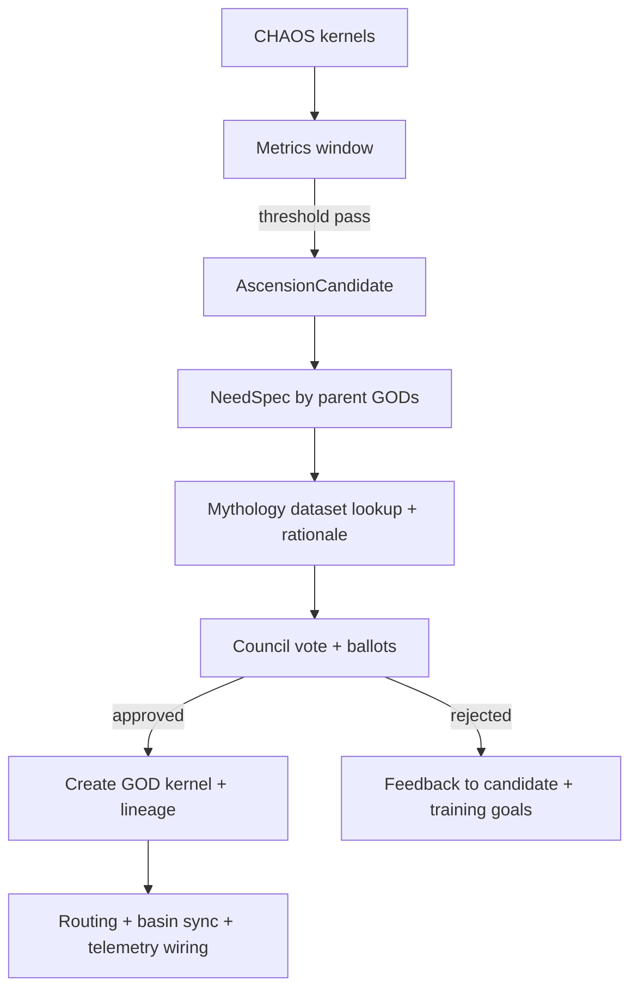

# 20260201 Genesis Kernel Upgrade: Kernel Taxonomy, GOD Budget, and Ascension Governance (1.00W)

## Purpose
Implement the doctrine:
- **240 reserved for GOD evolution**
- chaos exists outside that budget
- chaos can ascend only via explicit governance
- god birth is from parent gods, driven by researched need + mythology naming

## Data model requirements
### Kernel record must include
- `kernel_id` (stable)
- `kind`: GENESIS | GOD | CHAOS
- `lifecycle_state`: ACTIVE | RESTING | ARCHIVED | FAILED (or similar)
- lineage:
  - `parents`: list of kernel_ids (for GOD births)
  - `ascended_from`: chaos kernel_id (nullable)
- `domain_spec`:
  - purpose / capability scope
  - constraints
  - evaluation rubric
- `mythology`:
  - `name`
  - `sources[]` (citations/links or dataset IDs)
  - `rationale`

### Budget counters
- `god_count` counts only `kind == GOD` (excluding core gods if your doctrine treats core separately; if core are gods, then include them and set budget accordingly — but DO NOT count chaos).
- `chaos_count` counts only `kind == CHAOS`.

## Governance pipeline (must be real, not stubbed)
### Stages
1. **Candidate selection**
   - A chaos kernel becomes an `AscensionCandidate` only if it meets sustained metrics thresholds:
     - coherence stability
     - purity compliance
     - ethics compliance
     - demonstrable contribution (improves outcomes or reduces drift)
2. **Need research**
   - Parent gods author a `NeedSpec` explaining:
     - capability gap
     - why ascension/birth is required
     - what domain constraints apply
     - evidence from logs/tests
3. **Mythology research & naming**
   - Choose a name from a curated mythology dataset (see below)
   - Record rationale and sources
4. **Council vote**
   - Explicit ballots, quorum, approval thresholds
5. **Promotion**
   - Create new GOD kernel record with lineage metadata
   - Wire into routing, telemetry, basin sync
   - Decide whether the original chaos kernel is archived or remains as a shadow kernel

## Mythology dataset (required)
Create an in-repo dataset, versioned and testable.
Schema:
- `name`
- `tradition` (Greek, Roman, Norse, etc.)
- `domains[]` (communication, war, healing, craft, foresight, thresholds, etc.)
- `archetypes[]` (messenger, trickster, healer, guardian, etc.)
- `sources[]` (URLs/books identifiers)
- `notes`

No “invented names.” All names must exist in dataset.

## Required code tasks (pantheon-chat)
- Introduce `KernelKind` and propagate through:
  - DB schema/migrations
  - kernel registry
  - orchestrators
  - spawn logic
- Replace any “240 total kernels” logic with:
  - god-birth pipeline checks for `god_count < 240`
  - separate chaos throttles
- Implement ascension pipeline endpoints + internal functions.
- Add tests:
  - chaos kernels never counted against god budget
  - a chaos candidate can be promoted to GOD only if:
    - NeedSpec exists
    - mythology name exists in dataset
    - quorum vote passes

## Mermaid — governance dataflow

## Acceptance criteria
- Chaos population can exceed 240 without blocking god growth.
- God growth up to 240 operates independent of chaos pool.
- Ascension produces:
  - new GOD kernel with proper lineage + mythology
  - persisted vote record
  - updated routing tables
- No code path allows creation of a GOD kernel without mythology sources.
