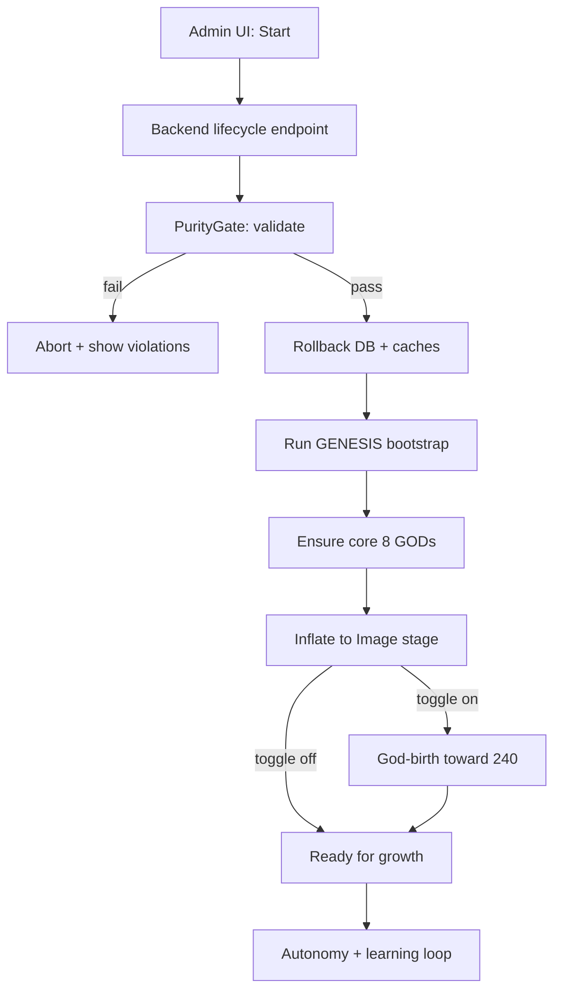

# 20260201 Genesis Kernel Upgrade: Start/Reset/Rollback (1.00W)

## Purpose
Create a **single canonical start operation**:
- triggered from the UI
- calls a Python module
- supports rollback + fresh start
- validates geometry purity first (fail closed)
- inflates in stages:
  - GENESIS bootstrap
  - core gods (8)
  - Image stage
  - optional continue toward full GOD 240

No mocks/stubs.

## Requirements
### Operator-visible stages
- Stage 0: Purity validation
- Stage 1: Rollback to clean baseline
- Stage 2: Genesis bootstrap
- Stage 3: Ensure core 8 gods
- Stage 4: Inflate to Image stage (real image modality integration)
- Stage 5: Optional: Continue GOD-birth toward 240 reserved

### Rollback/fresh start
- Must restore DB + persistent stores to a known baseline.
- Must be deterministic for the same seed/config.

### Purity gate (mandatory)
- Must run before any stage.
- Must validate:
  - forbidden ops absent in runtime modules
  - basin geometry functions are canonical
  - any installed optional deps do not silently enable embeddings/cosine shortcuts

### UI trigger
- Add an admin UI route/button:
  - “Fresh start (inflate to Image)”
  - toggle: “Continue to full 240 GODs”
- The UI calls backend endpoint(s) that launch the Python module and stream progress events.

## Mermaid — start flow

## Required code tasks
- Implement `LifecycleController`:
  - start request creates a lifecycle run record
  - executes the stages in order
  - emits progress events (SSE/websocket)
  - supports cancellation
- Implement `rollback_to_clean_state()`:
  - truncates/clears kernel tables, basin memory, caches
  - re-applies migrations or uses a reset strategy
  - seeds only the minimal bootstrap state
- Implement `inflate_to_image_stage()`:
  - ensures actual image modality processing exists:
    - image -> simplex distribution (via a QIG-valid transform)
    - attaches to kernel routing/telemetry
- Implement `continue_to_full_240()`:
  - triggers god-birth pipeline (not chaos spawner)
  - respects mythology naming + governance rules

## Acceptance criteria
- One documented “start” API endpoint invoked from UI.
- Start always runs PurityGate first; cannot be bypassed.
- Fresh start yields consistent baseline.
- Image stage can accept an image input and produce a valid basin + telemetry.
- Optional “continue to 240” uses god-birth, not chaos expansion.
