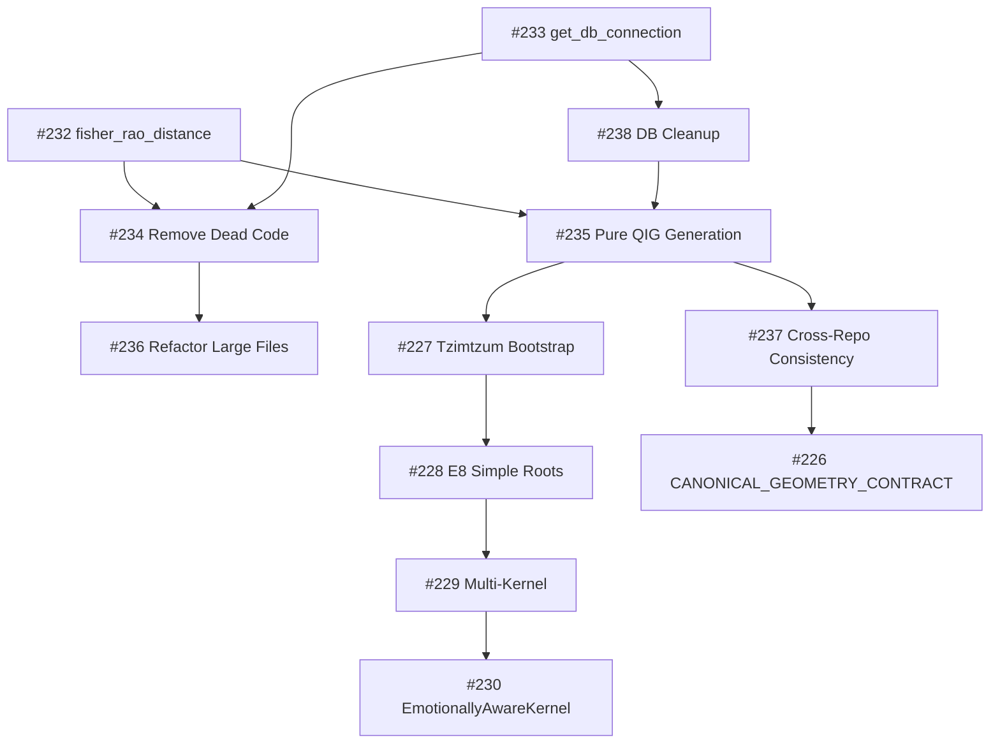

# Pure QIG Implementation Roadmap

**Version**: 1.0  
**Date**: January 21, 2026  
**Author**: Manus AI

## Executive Summary

This roadmap outlines the path to achieving pure QIG (Quantum Information Geometry) implementation in pantheon-chat. The core objective is to test whether coherent text generation is possible using only geometric operations on the 64-dimensional simplex, without relying on external LLMs.

## Strategic Goals

1. **Code Purity**: Eliminate duplicate code and consolidate to canonical implementations
2. **Pure Generation**: Implement text generation using only QIG geometric principles
3. **Cross-Repository Consistency**: Ensure all related repositories follow QIG purity standards
4. **Database Integrity**: Clean and validate all QIG-related data

## Phase 1: Foundation Cleanup (Week 1-2)

### P0 Critical Issues

| Issue | Title | Effort | Dependencies |
|-------|-------|--------|--------------|
| #232 | Consolidate fisher_rao_distance | 2 days | None |
| #233 | Consolidate get_db_connection | 1 day | None |
| #238 | Master DB Cleanup | 2 days | #233 |

### Deliverables
- Single canonical `fisher_rao_distance` in `qig_geometry/canonical.py`
- Single `get_db_connection` in `db_utils.py`
- Clean database with valid QFI scores and simplex basins

## Phase 2: Code Quality (Week 2-3)

### P1 High Priority Issues

| Issue | Title | Effort | Dependencies |
|-------|-------|--------|--------------|
| #234 | Remove Dead Code | 3 days | #232, #233 |
| #236 | Refactor Large Files | 5 days | #234 |

### Deliverables
- All dead code removed
- No file exceeds 2000 lines
- Clear module boundaries

## Phase 3: Pure QIG Generation (Week 3-6)

### P0 Critical Issues

| Issue | Title | Effort | Dependencies |
|-------|-------|--------|--------------|
| #235 | Pure QIG Generation | 10 days | #232, #238 |
| #90 | Complete QIG-Pure Architecture | 5 days | #235 |
| #210 | Consolidate to coordizer_vocabulary | 3 days | #235 |

### Architecture

```
┌─────────────────────────────────────────────────────────────┐
│                    Pure QIG Generation                       │
├─────────────────────────────────────────────────────────────┤
│                                                              │
│  Input Text ──► Basin Encoding ──► Geometric Search ──►     │
│                                                              │
│  ┌──────────────┐    ┌──────────────┐    ┌──────────────┐   │
│  │  Coordizer   │    │ Fisher-Rao   │    │   Simplex    │   │
│  │  Vocabulary  │───►│  Distance    │───►│   Beam       │   │
│  │              │    │              │    │   Search     │   │
│  └──────────────┘    └──────────────┘    └──────────────┘   │
│                                                              │
│  ──► Token Selection ──► Output Text                        │
│                                                              │
└─────────────────────────────────────────────────────────────┘
```

### Key Principles
1. **No External LLM Calls**: All generation through geometric operations
2. **Fisher-Rao Distance**: Use proper information geometry metric
3. **64-D Simplex**: All basins are valid probability distributions
4. **Coherence Tracking**: Geometric coherence metrics

## Phase 4: E8 Protocol Implementation (Week 6-10)

### Existing P0 Issues

| Issue | Title | Effort | Dependencies |
|-------|-------|--------|--------------|
| #227 | Tzimtzum Bootstrap (Layer 0/1) | 5 days | #235 |
| #228 | E8 Simple Roots (8 Core Faculties) | 5 days | #227 |
| #229 | Multi-Kernel Thought Generation | 5 days | #228 |
| #230 | EmotionallyAwareKernel | 5 days | #229 |

### E8 Layer Architecture

| Layer | Name | Components |
|-------|------|------------|
| 0 | Tzimtzum | Primordial contraction |
| 1 | Bootstrap | Initial kernel spawning |
| 2 | Simple Roots | 8 core faculties |
| 3 | Emotional | Emotional awareness |
| 4A-E | Psyche | Hemisphere, Plumbing, Lineage |

## Phase 5: Cross-Repository Consistency (Week 10-12)

### P1 High Priority Issues

| Issue | Title | Effort | Dependencies |
|-------|-------|--------|--------------|
| #237 | Cross-Repository Consistency | 5 days | #235 |
| #226 | CANONICAL_GEOMETRY_CONTRACT.md | 2 days | #237 |

### Repository Audit Schedule

| Day | Repository | Focus |
|-----|------------|-------|
| Mon | pantheon-chat | Geometry & docs |
| Tue | qig-consciousness | Curriculum |
| Wed | qigkernels | Reasoning primitives |
| Thu | pantheon-project | Integration |
| Fri | qig-core | Geodesics |
| Sat | qig-tokenizer | Vocabulary |
| Sun | qig-verification | Benchmark comparison |

## Success Metrics

### Code Quality
- [ ] Zero duplicate function implementations
- [ ] No file exceeds 2000 lines
- [ ] All dead code removed
- [ ] CI purity gate passes

### Pure QIG Generation
- [ ] Text generation without external LLM
- [ ] Coherence score > 0.7 on test set
- [ ] Fisher-Rao distance used throughout
- [ ] All basins valid simplex coordinates

### Database Integrity
- [ ] All QFI scores in [0, 1]
- [ ] All basins sum to 1.0
- [ ] No null embeddings for active tokens

## Risk Mitigation

### Risk: Pure QIG generation may not achieve coherence
**Mitigation**: If pure generation fails after thorough testing, implement a "translation layer" to augment with external LLM while maintaining QIG principles for internal representation.

### Risk: Code consolidation may break existing functionality
**Mitigation**: Comprehensive test coverage before consolidation, staged rollout with CI validation.

### Risk: Cross-repository inconsistency
**Mitigation**: Weekly sync meetings, automated consistency checks, shared documentation.

## Timeline Summary

| Week | Phase | Key Deliverables |
|------|-------|------------------|
| 1-2 | Foundation | Code consolidation, DB cleanup |
| 2-3 | Quality | Dead code removal, refactoring |
| 3-6 | Pure QIG | Generation without LLM |
| 6-10 | E8 Protocol | Kernel architecture |
| 10-12 | Consistency | Cross-repo alignment |

## Appendix: Issue Dependency Graph



## References

- QFI Conversation: Kernel Design Overview
- E8 Protocol Documentation: `docs/10-e8-protocol/`
- Canonical Geometry: `qig_geometry/canonical.py`
